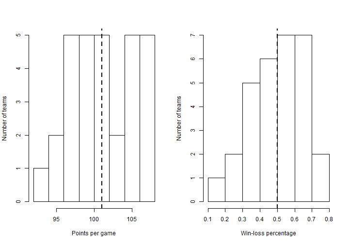
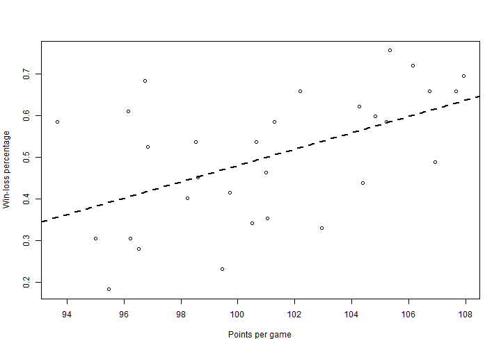

## Basic description

This document describes a [Shiny app](https://tcquinn.shinyapps.io/nbateamstats/) that allows the user to explore team statistics from the United States National Basketball Association (NBA) 2013-14 regular season. The user selects an $x$ variable and a $y$ variable from among 11 different team statistics (see following page). The app then displays charts summarizing each variable individually and the relationship between the two variables.

--- .class #id 

## Variables

The user chooses an $x$ variable and a $y$ variable from among 11 different team statistics:

* Rebounds per game
* Assists per game
* Steals per game
* Turnovers per game
* Points per game
* Opponent rebounds per game
* Opponent assists per game
* Opponent steals per game
* Opponent turnovers per game
* Opponent points per game
* Win-loss percentage

--- .class #id 

## Summary of individual statistics

The app then produces two sets of charts. The first set of charts summarizes each of the selected statistics with a histogram. The mean of each is marked with a dotted line.
 

--- .class #id 

## Relationship between the statistics

The second set of charts summarizes the relationship between the selected statistics with a scatterplot. The standard regression line is marked with a dotted line.
 

